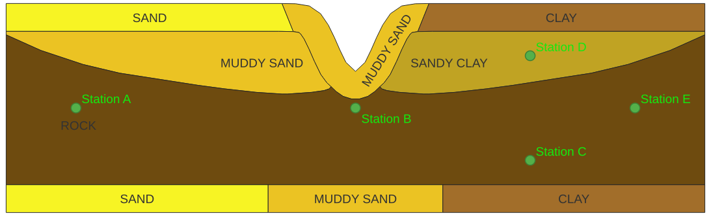

# Headland Channel - Friction Field Calibration

This example shows how adjoint methods can be used in gradient-based optimisation of a control parameter/field to 
minimise the difference between measured and modelled data at gauging stations. Here, synthetic measured velocity data 
is generated using a forward run with known input parameters. The calibration/optimisation problem is then performed 
using the adjoint technique, keeping all the parameters the same except for our `Control`. 5 stations are used, as shown
in the forward run section.

The control field used here is the Manning parameter, which controls the bottom drag i.e. the friction. This field can 
take various 'mappings', which are covered case-by-case in the Inversion run sections:

- Full nodal flexibility: the `Control` is the entire friction field, which is allowed to change at every single node on
the mesh, within the prescribed lower and upper limits. Hessian regularisation can be used to ensure node-to-node 
changes are not too severe. See [Kärnä et al., 2023](https://doi.org/10.1029/2022MS003169) for detailed explanations.
- Uniform bed friction: the `Control` is one `Constant` value, which keeps the bed friction uniform across the domain.
- Region-based friction: the `Control` is a set of values, corresponding to certain regions of the model. These regions 
may be a simple split between areas of the domain or may be based on seabed particle data - see 
[Warder et al., 2022](http://dx.doi.org/https://doi.org/10.1007/s10236-022-01507-x), for example.
- Independent point scheme: as for the region-based approach, the `Control` is a set of values, but this time it is
associated with a set of points. Between points, the value of the friction parameter is interpolated - see 
[Lu and Zhang, 2006](https://doi.org/10.1016/j.csr.2006.06.007), for example.

## Forward run

The synthetic data is stored in the time series `.hdf5` files for each station. The forward run is provided so that the
input parameters can be changed by the user for further experimentation.

The forward run used to generate this uses the same model configuration as provided by `model_config.py` which 
configures the `solver object`, but with a friction field based on a sea bed particle sizes as shown below:



The idealised headland is 20km long and 6km wide, with a coastline depth of 3m and a main channel depth of 40m. The left 
and right boundaries are forced by a sinusoidal elevation function, emulating a single tidal signal. A viscosity sponge 
is used at the left hand boundary to provide some model stability.

## Inversion run

The inversion problem is currently run from a `Makefile`. User arguments are specified here i.e. mapping to use, serial 
or parallel execution, and then the Makefile runs the scripts with the inputs provided.

The solver object is set up using `construct_solver` and then initial values for each field (in this case we only 
optimise for bed friction) are specified. The station manager, `StationObservationManager` , is then defined, which is 
from the modified version of the inversion tools provided by Thetis. In this case, as the calibration points have been 
defined by a forward run, we can use `load_observation_data` to interpolate the observation time series to the model 
time and also stores the time series data to disk. The station manager will also include the variable that is being 
optimised for, in this case, the velocity components.

We can then set up the inversion manager, `InversionManager`, again from the modified version of the inversion tools of 
Thetis. The station manager is the first argument and the two key other arguments are the penalty parameters and cost 
scaling. We will use the penalty parameters only for the full nodal flexibility case, as the others are effectively 
spatially regularised by their mappings. The cost function, J(u), is defined using the inversion manager as the L2 norm, 
except in the full nodal flexibility case, where it has additional regularisation.

The forward model is run using `solver_obj.iterate`, with the cost function embedded via a callback, which is an 
important step for the adjoint method. Passing the cost function callback effectively embeds the dependency of the model 
state on the control variables into the cost function, forming the **reduced functional**. The **reduced functional**, 
J_hat(c), is not just the original cost function, J(u), plus a regularization term — it **includes the entire forward 
model**. This means that to evaluate the reduced functional, all computations required to solve the model equations and
obtain the model state u(c) corresponding to a given control, c, are taken into account. Running the forward model not
only gives the baseline cost, but also calculates the gradients of the reduced functional with respect to the control
variables (e.g., friction), which are then passed to the adjoint method. Finally, the annotation process (which has been
recording all computations related to the cost function, its derivatives, and the forward model) is stopped. This
process allows us to efficiently compute the gradients needed for calibration.

Optimisation parameters are then defined, which are the maximum number of iterations and the tolerance for the 
optimisation convergence criterion (threshold for the relative change in the cost function, below which the optimisation 
process will terminate). The optimisation is run by calling `inv_manager.minimize`. The L-BFGS-B algorithm is used as it
is suitable for bound-constrained problems, which are specified earlier alongside the penalty parameters for the cost 
functional. These are the minimum and maximum values of bed friction allowed.

The remainder of the script performs file saving and preparation for visualisation in ParaView.

### Full Nodal Flexibility

```sh
source ~/firedrake/bin/activate
make invert CASE=NodalFreedom
```

In the full nodal flexibility case, the friction values can vary freely within the lower and upper limits defined by the
control bounds. However, the cost function is regularised by an additional term, in this case, the Hessian (second 
derivative) of the elevation field. This prevents overfitting of the Manning field i.e. having a highly variable field.
The penalty parameters are the regularisation parameters that control the strength of the regularisation. Higher values 
increase the  weight of the penalty term, leading to a smoother friction field, while lower values allow more 
variability. The cost scaling normalises the regularisation term by the local mesh element size, so that the degree of 
penalization adapts to the local mesh resolution. In regions with finer mesh resolution, the scaling ensures that higher
variability in friction is allowed, whilst in regions of lower resolution less variability is allowed to prevent 
overfitting to sparse data points. The cost function that is defined using the inversion manager here, is the Hessian 
regularised L2 norm. The actual class, `HessianRecoverer2D`, for calculating this loss can be found in 
`thetis.diagnostics.py`.

### Uniform Bed Friction

```sh
source ~/firedrake/bin/activate
make invert CASE=Constant
```

For a uniform bed friction, there are some differences which are enforced by changing the case entry, as explained 
below.

Firstly, we do not need penalty parameters in the inversion problem as we will not have any variation across the field
and thus there is no smoothing required. Now, instead of adding the Manning field as a `Control`, we will define the 
friction through a `Constant`, and then project this `Constant` onto the Manning field. This `Constant` then becomes our
`Control`, and as it is a `Constant`, it cannot vary. This is inherently dealt with by `Firedrake` and `pyadjoint`. 

The standard implementation of `InversionManager` in Thetis is not flexible in dealing with the `Control` not being 
a `Function` i.e. the Manning, bathymetry etc., so we this is where modifications start to come in. 
We need to export the Manning at each iteration, so we need to extract the mesh from the `StationObservationManager`, 
extract the function space and create a `Function` to assign the `Control` value to. This can then be exported to `.vtu` 
at each iteration.

### Region Based Bed Friction

```sh
source ~/firedrake/bin/activate
make invert CASE=Regions
```

For region-based bed friction, the `InversionManager` has again been modified so that we can export things 
correctly. Here, we need to create a mapping that relates the Manning values to the regions of the mesh. Again, there is 
no need for penalising the Hessian. We also need to use a `Constant` for each area, and each `Constant` is one 
`Control`. The adjoint works on graphical connections, so we need to ensure that the adjoint process can back-propagate 
through the various layers to our `Controls`. This is why we need to store our values as `Functions` on our `mesh` 
`FunctionSpace`. 

We can define four regions, for example, in the following manner:

```
mask_values = [np.logical_and(x < 50e3, y < 6e3).astype(float),
               np.logical_and(x < 50e3, y >= 6e3).astype(float),
               np.logical_and(x >= 50e3, y < 6e3).astype(float),
               np.logical_and(x >= 50e3, y >= 6e3).astype(float)]
               
# Create Function objects to store the coefficients
m_true = [Constant(i+1., domain=mesh2d) for i in range(len(mask_values))]
masks = [Function(V) for _ in range(len(m_true))]

# Assign the mask values to the Functions
for i, mask_ in enumerate(masks):
    mask_.dat.data[:] = mask_values[i]
```

Importantly, the masks i.e. our regions, will remain consistent. The only thing that will change will be the values 
associated with each mask. This means we can define each mask by assigning its values from `NumPy` operators using 
`mask.dat.data[:] = mask_values[i]`. In the case of bed particle size mapping, this is important, because it would be 
challenging to have to define a series of `conditional` or other operators to define each area. Note that if we 
included this assignment of the masks at each iteration of the adjoint, it would not work as there is no graphical 
connection when we do assignments with `function.dat.data[:] = values`. We can then map our values as follows:

```
manning_2d.assign(0)
# Add the weighted masks to n
for m_, mask_ in zip(m_true, masks):
    manning_2d += m_ * mask_
```

We then iterate through each mask (region) and then add the corresponding value of Manning (n) friction. We now have a 
mapping that `PyAdjoint` can understand.

As for the `InversionManager`, we can then provide this mapping through an `update_n` function which allows us to export
the `Control` and `Gradient` fields correctly, rather than having `m` outputs for `m` controls. We can then run the 
forward, inverse and plotting scripts in order.

### Independent Point Scheme

```sh
source ~/firedrake/bin/activate
make invert CASE=IndependentPointsScheme
```

The independent point scheme approach works in the same way as the region-based approach, where we have a mapping 
function which tells us how the Manning field changes with respect to our input independent point values. We can use the
same `InversionManager` updates, and the only thing we need to do is change the masks we generate. For a linear 
interpolation of the points, this mapping is generated as follows:

```
# Get domain limits, define independent points and specify their values
lx, ly = np.max(x), np.max(y)  # done differently in parallel
points = [(lx/4, ly/4), (lx/4, 3*ly/4), (lx/2, ly/4), (lx/2, 3*ly/4),
          (3*lx/4, ly/4), (3*lx/4, 3*ly/4)]
m_true = [Constant(0.01*(i+1), domain=mesh2d) for i in range(len(points))]
M = len(m_true)

# Use Python's numpy to create arrays for the interpolation points
interp_x = np.array([p[0] for p in points])
interp_y = np.array([p[1] for p in points])
points = np.column_stack((interp_x, interp_y))

# Create the interpolators, use nearest neighbour interpolation outside the convex 
# hull of the linear interpolator
linear_interpolator = LinearNDInterpolator(points, np.eye(len(points)))
nearest_interpolator = NearestNDInterpolator(points, np.eye(len(points)))

# Apply the interpolators to the mesh coordinates to get linear coefficients 
# (these do not depend on the magnitude of the points)
linear_coefficients = linear_interpolator(coordinates)
nan_mask = np.isnan(linear_coefficients).any(axis=1)
linear_coefficients[nan_mask] = nearest_interpolator(coordinates[nan_mask])

# Create Function objects to store the coefficients
masks = [Function(V) for _ in range(len(points))]

# Assign the linear coefficients to the masks
for i, mask in enumerate(masks):
    mask.dat.data[:] = linear_coefficients[:, i]
```

Now, instead of masks with 0/1 values, we have masks which describe the contribution of each point to the rest of the 
domain. Note that this will only work for linear interpolation, as we cannot generate static coefficients for non-linear
mappings (RBF, quadratic, cubic etc.). In those cases, we would need to 'annotate' the interpolation functions for 
`PyAdjoint` to track the gradient through. 

## Post-processing

```sh
source ~/firedrake/bin/activate
make plot CASE=NodalFreedom
make plot CASE=Constant
make plot CASE=Regions
make plot CASE=IndependentPointsScheme
```

To plot the progress, we can use the Makefile to run `plot_velocity_progress.py`. This plots the velocity over time at 
each of the station locations for each iteration of the optimisation, relative to the ground truth from the forward run.

## Running in parallel

The default settings run these scripts in parallel, however we can leverage parallel processing to accelerate the 
simulations by partioning the mesh. To do so, simply provide the number of processors you would like to use after the 
PARALLEL option, e.g.:

```sh
source ~/firedrake/bin/activate
make invert CASE=IndependentPointsScheme PARALLEL=4
```
