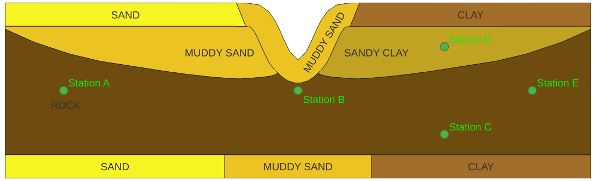

# Headland Channel - Friction Field Calibration

This example shows how adjoint methods can be used in gradient-based optimisation of a control parameter/field to 
minimise the difference between measured and modelled data at gauging stations. Here, synthetic measured velocity data 
is generated using a forward run with known input parameters. The calibration/optimisation problem is then performed 
using the adjoint-based technique, keeping all the parameters the same except for our `Control`. 5 stations are used, as 
shown in the forward run section.

The control field used here is the Manning parameter, which controls the bottom drag i.e. the friction. This field can 
take various 'mappings', which are covered case-by-case in the Inversion run sections:

- Gradient/Hessian regularised: the `Control` is the entire friction field, which is allowed to change at every single 
node on the mesh, within the prescribed lower and upper limits. Gradient or Hessian regularisation (of the control 
field) can be used to ensure node-to-node changes are not too severe. See [Kärnä et al., 2023](https://doi.org/10.1029/2022MS003169) for detailed 
explanations.
- Uniform bed friction: the `Control` is one uniform value, which keeps the bed friction uniform across the domain.
- Region-based friction: the `Control` is a set of values, corresponding to certain regions of the model. These regions 
may be a simple split between areas of the domain or may be based on seabed particle data - see 
[Warder et al., 2022](http://dx.doi.org/https://doi.org/10.1007/s10236-022-01507-x), for example.
- Independent point scheme: as for the region-based approach, the `Control` is a set of values, but this time it is
associated with a set of points. Between points, the value of the friction parameter is interpolated - see 
[Lu and Zhang, 2006](https://doi.org/10.1016/j.csr.2006.06.007), for example.

## Quick start

This example can now be run in two modes:

- **Regular run**: one forward solve and one inversion using all available stations together.
- **Ensemble run**: one station per ensemble member, with a forcing phase offset applied to each member. The inversion
  then combines all members into a single optimisation problem.

Typical regular workflow:

```sh
source ~/firedrake/bin/activate
make forward ENSEMBLE=false
make plot_obs ENSEMBLE=false
make invert CASE=GradientReg ENSEMBLE=false
make plot CASE=GradientReg ENSEMBLE=false
```

Typical ensemble workflow:

```sh
source ~/firedrake/bin/activate
make forward ENSEMBLE=true RANKS_PER_MEMBER=2 N_MEMBERS=7
make plot_obs ENSEMBLE=true
make invert CASE=GradientReg ENSEMBLE=true RANKS_PER_MEMBER=2 N_MEMBERS=7
make plot CASE=GradientReg ENSEMBLE=true
```

or, to run using the default `Makefile` variable values, simply:

```sh
make
```

## Makefile options

The example is driven through the local `Makefile`.

Important variables are:

- `CASE`: inversion parametrisation to use. One of
  `Uniform`, `Regions`, `IndependentPointsScheme`, `GradientReg`, `HessianReg`.
- `ENSEMBLE`: `true` or `false`.
- `RANKS_PER_MEMBER`: MPI ranks per ensemble member in ensemble mode.
- `N_MEMBERS`: number of ensemble members. At present this should match the number of configured stations, i.e. `7`.
- `PARALLEL`: total number of MPI ranks used by `mpiexec`.

In ensemble mode the intended layout is:

```text
PARALLEL = N_MEMBERS * RANKS_PER_MEMBER
```

In regular mode, `PARALLEL` is simply the total number of MPI ranks used for a single simulation.

## Forward run

The synthetic data is stored in the time series `.hdf5` files for each station. The forward run is provided so that the
input parameters can be changed by the user for further experimentation.

The forward run used to generate this uses the same model configuration as provided by `model_config.py` which 
configures the `solver object`, but with a friction field based on a sea bed particle sizes as shown below:



The idealised headland is 20km long and 6km wide, with a coastline depth of 3m and a main channel depth of 40m. The left 
and right boundaries are forced by a sinusoidal elevation function, emulating a single tidal signal. A viscosity sponge 
is used at the left hand boundary to provide some model stability.

Run the forward model in regular mode with:

In regular mode, all station time series are written into:

```text
outputs/outputs_forward/
```

In ensemble mode, one station is written per member into:

```text
outputs/outputs_forward/member_<k>/
```

with a forcing time offset of `800 * ensemble_rank` seconds. The current station/member mapping is:

- member 0 -> stationA
- member 1 -> stationB
- member 2 -> stationC
- member 3 -> stationD
- member 4 -> stationE
- member 5 -> stationF
- member 6 -> stationG


## Inversion run

The inversion problem is run from the `Makefile`. The same `CASE` values can be used in both regular and ensemble modes.

The solver object is set up using `construct_solver` and then initial values for each field (in this case we only 
optimise for bed friction) are specified. The station manager, `StationObservationManager`, is then instantiated, which 
contains the field we are optimising for and the data itself. We register the synthetic ground truth data with 
`register_observation_data`. The `StationObservationManager` can interpolate the observation time series to the model 
time and also stores the time series data on disk. 

We can then set up the inversion manager, `InversionManager`, again from the inversion tools of Thetis. The station 
manager is the first argument and the two key other arguments are the penalty parameters and cost scaling. We will use
the penalty parameters only for the Gradient/Hessian regularisation case, as the others are effectively spatially 
regularised by their mappings. The cost function, J(u), is defined using the inversion manager as the L2 norm, 
except in the Gradient/Hessian regularised cases, where it has an explicit additional regularisation term. 

The forward model is run using `solver_obj.iterate`, with the cost function embedded via a callback, which is an 
important step for the adjoint method. Passing the cost function callback effectively embeds the dependency of the model 
state on the control variables into the cost function, forming the **reduced functional**. The **reduced functional**, 
J_hat(c), is not just the original cost function, J(u), plus a regularization term — it **includes the entire forward 
model**. This means that to evaluate the reduced functional, all computations required to solve the model equations and
obtain the model state u(c) corresponding to a given control, c, are taken into account. Running the forward model not
only gives the baseline cost, but also calculates the gradients of the reduced functional with respect to the control
variables (e.g., friction), which are then passed to the adjoint method. Finally, the annotation process (which has been
recording all computations related to the cost function, its derivatives, and the forward model) is stopped. This
process allows us to efficiently compute the gradients needed for calibration.

Optimisation parameters are then defined, which are the maximum number of iterations and the tolerance for the 
optimisation convergence criterion (threshold for the relative change in the cost function, below which the optimisation 
process will terminate). The optimisation is run by calling `inv_manager.minimize`. The L-BFGS-B algorithm is used as it
is suitable for bound-constrained problems, which are specified earlier alongside the penalty parameters for the cost 
functional. These are the minimum and maximum values of bed friction allowed.

The remainder of the script performs file saving and preparation for visualisation in ParaView.

In regular mode, inversion outputs are written into:

```text
outputs/outputs_inverse/<case_dir>/
```

In ensemble mode, they are written into:

```text
outputs/outputs_inverse/<case_dir>/member_<k>/
```

### Gradient/Hessian regularisation

```sh
source ~/firedrake/bin/activate
make invert CASE=GradientReg ENSEMBLE=false
make invert CASE=GradientReg ENSEMBLE=true RANKS_PER_MEMBER=2 N_MEMBERS=7
```

In these cases, the friction values can vary freely within the lower and upper limits defined by the control bounds. 
However, the cost function is regularised by an additional term, in this case, the Hessian (second derivative) of the 
Manning coefficient field. This prevents overfitting of the Manning field i.e. having a highly variable field.
The penalty parameters are the regularisation parameters that control the strength of the regularisation. Higher values 
increase the weight of the penalty term, leading to a smoother friction field, while lower values allow more 
variability. The cost scaling normalises the regularisation term by the local mesh element size, so that the degree of 
penalization adapts to the local mesh resolution. In regions with finer mesh resolution, the scaling ensures that higher
variability in friction is allowed, whilst in regions of lower resolution less variability is allowed to prevent 
overfitting to sparse data points. This can be switched off such that it just normalises the units using the smallest 
mesh element size uniformly across the mesh as it may not always suit the problem. The cost function that is defined 
using the inversion manager here, is the Gradient/Hessian regularised L2 norm. The actual classes, `GradientRecoverer2D` 
and `HessianRecoverer2D`, for calculating this loss can be found in `thetis.diagnostics.py`.

### Uniform Bed Friction

```sh
source ~/firedrake/bin/activate
make invert CASE=Uniform ENSEMBLE=false
make invert CASE=Uniform ENSEMBLE=true RANKS_PER_MEMBER=2 N_MEMBERS=7
```

For a uniform bed friction, there are some differences which are enforced by changing the case entry, as explained 
below.

Firstly, we do not need penalty parameters in the inversion problem as we will not have any variation across the field
and thus there is no smoothing required. Now, instead of adding the Manning field as a `Control`, we will define the 
friction through a uniform value which is projected onto the Manning field. This uniform value then becomes our
`Control`, and as it is defined as a uniform value, it cannot vary. This is inherently dealt with by `Firedrake` and 
`pyadjoint`. 

We need to export the Manning at each iteration, so we need to extract the mesh from the `StationObservationManager`, 
extract the function space and create a `Function` to assign the `Control` value to. This can then be exported to `.vtu` 
at each iteration. This is done with the `ControlManager`, which deals with determining if our Control is a function 
that can spatially vary, a uniform value or a set of values (i.e. for the next set of cases) and then deals with the 
exporting.

### Region Based Bed Friction

```sh
source ~/firedrake/bin/activate
make invert CASE=Regions ENSEMBLE=false
make invert CASE=Regions ENSEMBLE=true RANKS_PER_MEMBER=2 N_MEMBERS=7
```

For region-based bed friction, we need to create a mapping that relates the Manning values to the regions of the mesh. 
We can simply pass our list of Controls; which are uniform values per region; and the `ControlManager` will deal with 
them. In this case, we need to pass an additional term `mappings=masks` when we use `add_control` so the 
`ControlManager` can export our Manning coefficient field correctly.

Importantly, the masks i.e. our regions, will remain consistent. The only thing that will change will be the values 
associated with each mask. This means we can define each mask by assigning its values from `NumPy` operators using 
`mask.dat.data[:] = mask_values[i]`. In the case of bed particle size mapping, this is important, because it would be 
challenging to have to define a series of `conditional` or other operators to define each area. N

As for the `InversionManager`, we can then provide this mapping through an `update_n` function which allows us to export
the `Control` and `Gradient` fields correctly, rather than having `m` outputs for `m` controls. We can then run the 
forward, inverse and plotting scripts in order.

### Independent Point Scheme

```sh
source ~/firedrake/bin/activate
make invert CASE=IndependentPointsScheme ENSEMBLE=false
make invert CASE=IndependentPointsScheme ENSEMBLE=true RANKS_PER_MEMBER=2 N_MEMBERS=7
```

The independent point scheme approach works in the same way as the region-based approach, where we have a mapping 
function which tells us how the Manning field changes with respect to our input independent point values. The only thing 
we need to do is change the masks we generate. 

Instead of masks with 0/1 values, we have masks which describe the contribution of each point to the rest of the 
domain. Note that this will only work for linear interpolation, as we cannot generate static coefficients for non-linear
mappings (RBF, quadratic, cubic etc.). In those cases, we would need to 'annotate' the interpolation functions for 
`pyadjoint` to track the gradient through. We can generate a mapping in the same way to force a smooth surface, but it 
would not be true RBF/quadratic/cubic interpolation.

## Post-processing

```sh
source ~/firedrake/bin/activate
make plot_obs ENSEMBLE=false
make plot_obs ENSEMBLE=true
make plot CASE=GradientReg ENSEMBLE=false
make plot CASE=GradientReg ENSEMBLE=true
```

`plot_observed_elev.py` scans the selected forward-output directory layout and displays the observed elevation time
series.

`plot_velocity_progress.py` compares inversion progress against the forward data and saves PNG files named like:

```text
optimization_progress_<CASE>_<station>_ts.png
```

## Running in parallel

The scripts can be run in parallel in both regular and ensemble modes.

In regular mode, `PARALLEL` is the total MPI rank count for a single simulation, e.g.:

```sh
source ~/firedrake/bin/activate
make invert CASE=IndependentPointsScheme ENSEMBLE=false PARALLEL=4
```

In ensemble mode, the intended rank layout is:

```text
PARALLEL = N_MEMBERS * RANKS_PER_MEMBER
```

for example:

```sh
source ~/firedrake/bin/activate
make invert CASE=IndependentPointsScheme ENSEMBLE=true N_MEMBERS=7 RANKS_PER_MEMBER=2
```

Note that if you try to use too many threads, the communication time between processes will dominate the runtime and 
actually slow things down!

## Running as ensemble

`EnsembleReducedFunctional` can be leveraged to combine multiple inversions into a single optimisation problem. This is
useful for cases where we have multiple sets of observations that do not coincide in time, but we want to use them all 
to inform the same control field. 

In this case, the forward model is run with the forcing offset by 800 s in each subsequent ensemble with one station 
being logged in each case. Observations are therefore taken across different time windows. 
Each ensemble member in the inversion corresponds to a respective observation window from the forward run.

The recommended way to run the ensemble workflow is through the `Makefile`:

```sh
make forward ENSEMBLE=true RANKS_PER_MEMBER=2 N_MEMBERS=7
make invert CASE=IndependentPointsScheme ENSEMBLE=true RANKS_PER_MEMBER=2 N_MEMBERS=7
make plot_obs ENSEMBLE=true
make plot CASE=IndependentPointsScheme ENSEMBLE=true
```

The number of cores must correspond to the number of ensemble members times the number of threads allocated to each 
member (specified by parameter M in forward_run.py). 
In this case 7 ensemble members are set up for seven stations, with each member splitting its mesh across 2 threads.

If you prefer to run the scripts directly, the equivalent commands are, e.g.:

```sh
mpiexec -n 14 python forward_run.py --ensemble --ranks-per-member 2
mpiexec -n 14 python inverse_problem.py --ensemble --ranks-per-member 2 --case IndependentPointsScheme --no-taylor-test
python plot_observed_elev.py --ensemble
python plot_velocity_progress.py -s stationA --case IndependentPointsScheme --ensemble
```

For additional examples of Ensemble usage in firedrake, see
https://www.firedrakeproject.org/ensemble_parallelism.html
https://www.firedrakeproject.org/demos/full_waveform_inversion.py.html
